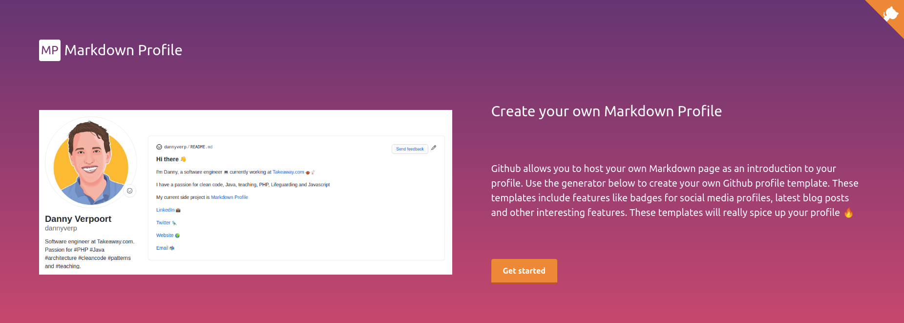

# Markdown Profiles
[](https://actions-badge.atrox.dev/atrox/sync-dotenv/goto)
[](LICENSE)


## About

Markdown Profiles is a project that generates markdown files for those that want an awesome Github profile.It provides several templates for you to use.

[](https://markdownprofile.com/)

## Table of contents

* [Markdown Profiles](#markdown-profiles)
  * [About](#about)
  * [Table of contents](#table-of-contents)
  * [Prerequisites](#prerequisites)
  * [Installation](#installation)
  * [Usage](#usage)
    * [Screenshots](#screenshots)
    * [Features](#features)
  * [Code](#code)
    * [Development](#development)
    * [Build](#build)
    * [Deploy](#deploy)
  * [Contributing / Reporting issues](#contributing--reporting-issues)
  * [License](#license)

## Prerequisites
In order to run the project the following requirements need to be met:
* [Git](https://git-scm.com/)
* [NodeJS / npm](https://nodejs.org/en/)

## Installation

Clone the repository to your local machine and go into the folder:

```shell script
git clone git@github.com:dannyverp/markdownprofile.git && \
cd markdownprofile
```

Download the vendor code using npm:

```shell script
npm install
```

## Usage

### Screenshots
### Features

## Code

### Development

To start developing please start the local development server:

```shell script
npm run dev
```

Now open http://localhost:3000 and start creating cool content 🚀

### Build

In order to build the project you can use NextJS's export functionality by running:

```
npm run export
```

This generates the HTML and Javascript files in the 'out' directory.

### Deploy

The project is configured to be deployed to Github Pages by using Github Actions. The github action is set up to create a `gh-pages` branch which will contain the content of the `out` directory.

In order to deploy using this actions please set up a `GITHUB_TOKEN` in your project's secrets. Check out the [Github Pages Action documentation](https://github.com/marketplace/actions/github-pages-action).

## Contributing / Reporting issues

Please check the [contribution guide](CONTRIBUTING.MD)

## License

[Apache License, Version 2.0](http://www.apache.org/licenses/LICENSE-2.0.html)